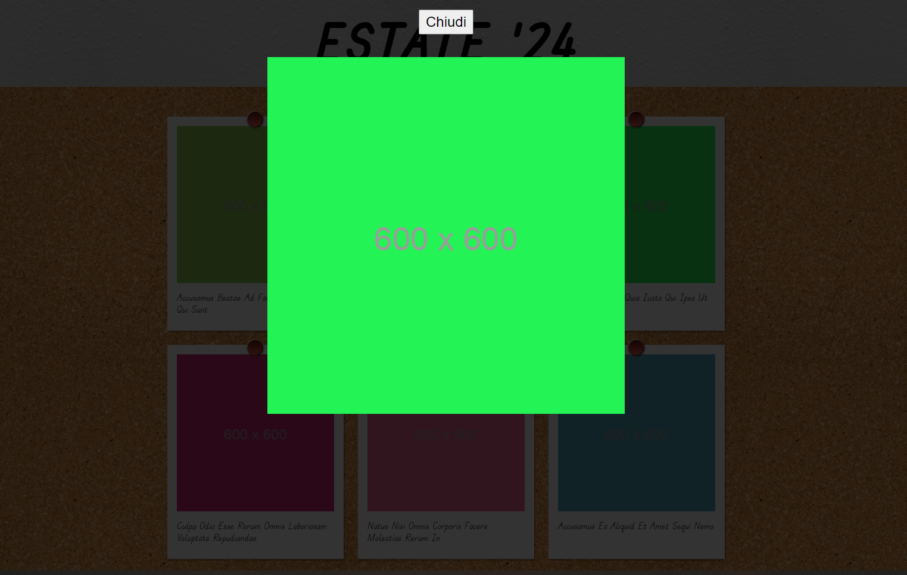

# Photo Blog

## Day 1

Prototype for day 1


### Milestone 1
- Through the attached screenshots we reproduce the graphics statically: using only HTML and CSS and reproducing a single photograph.


### Milestone 2

- Using Postman, we test a call to this endpoint: 
https://lanciweb.github.io/demo/api/pictures/
- Let's analyze the response and the data it provides and start thinking about how we can use it.

    #### API reference

- ##### URI
```
    https://lanciweb.github.io/demo/api/pictures/
```

- ##### Parameters

```
    No paramenters.
```

- ##### Description

```
    Get a list of pictures.
```

- ##### Response

```ruby
    [
        {
            "id": 1,
            "title": "Skate Park",
            "date": "01-07-2024",
            "url": "https://marcolanci.it/boolean/assets/pictures/1.png"
        },
        ...
    ]
```

### Milestone 3

- We create a JavaScript sheet and make an AJAX call to the API, exploiting the response to dynamically generate a series of pictures on the page!


---

## Day 2

Prototype for day 2

When click on the card


Image with hover effect


### Milestone 1

- We create an overlay that covers the entire page and inside, centered, we place any image and a close button.


### Milestone 2

- We make the overlay disappear with the help of a CSS class that sets the display: none .
After that, let's make it so that by clicking any photo, the overlay reappears.
By clicking the close button instead, the overlay disappears again.


---

## Languages Used


---

## Authors

- [@Mattia Zecchinato](https://www.github.com/MattiaZecchinato)